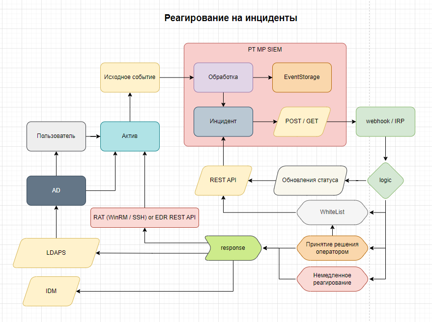
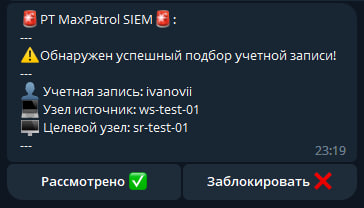
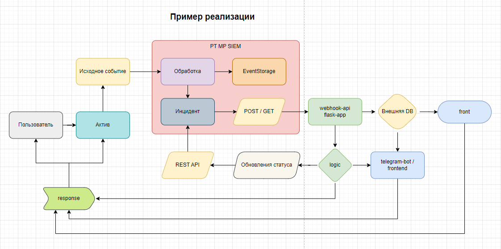

# Реагирование на инциденты (события типа инцидент) из PT MaxPatrol SIEM


#### Код представлен исключительно в ознакомительных целях.
#### ВАЖНО : Ваш сервер должен отвечать пайплайну максимально быстро, используйте потоки и кеширование!!!

#### Возможности:
1) Немедленное реагирование на событие типа инцидент, в режиме реального времени, из пайплайна обработки событий
2) Реагирование с подтверждением оператора, через Telegram
3) Логирование всех операций с ротацией локально на сервере интеграции
4) Передача логов в syslog
5) Получение изменения состояния инцидента от инженера, через чат Telegram
6) Хранение всех полученных событий и их состояния в SQLite для дальнейшего отчуждения
7) Есть возможность добавить реагирование на endpoint узлах через RAT / EDR
8) Есть возможность передачи состояний по API обратно в SIEM


#### Схема реагирования в PT MaxPatrol SIEM



#### Пример получения уведомления инженером для подтверждения реагирования



#### Как настроить у себя:
1) Заполнить файл конфигурации webhooks-ldaps.config данными от LDAP и Telegram
2) Запустить файлы webhook-ldaps и webhooks-bot на интеграционном сервере
3) Добавить в блок emit интересующе корреляции следующий код:

```
emit {
    # ..... initial emit code: $correlation_type = "incident"
    
    # Response
    $args = http_args_append("", "payload", join([$correlation_name, $subject.name, $subject.domain, $src.host, $dst.host], "|"))
    $response = http_get("http://webhook.integration-api.server.org:5081/getEndpoint", $args)

    # ..... over emit code (Можно использовать ответ полученный в переменную $response)
}
```

4) Указать вместо `webhook.integration-api.server.org` адрес интеграционного сервера
5) Блок join можно дополнить нужными полями события и добавить их обработку на стороне сервера интеграции
6) Провалидировать и применить правило
7) Проверить работу

#### Данная интеграция реализует следующую схему:


